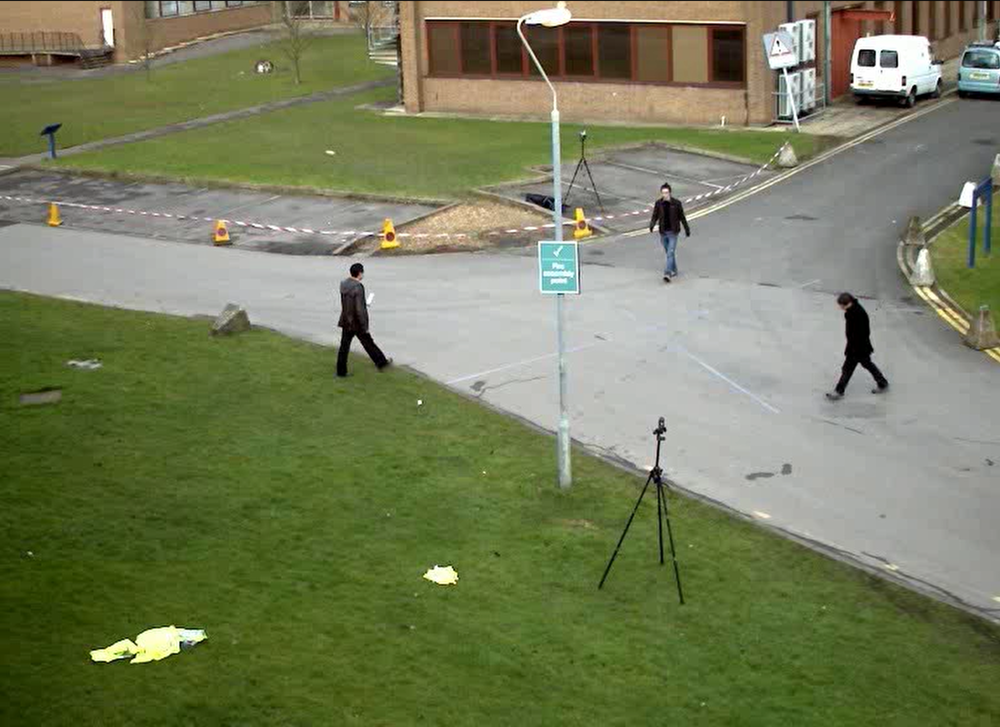
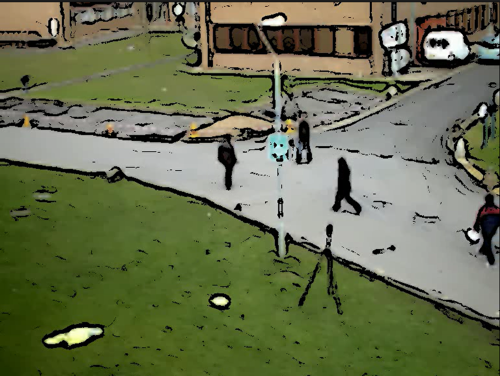

# Video to Cartoon

This project is a program that uses OpenCV to convert videos into cartoon style.


## Example

The image below is a frame from a video converted into cartoon style using this program.

### before
  

### after


## How to Use

1. **Run the Program**: Run the program by executing `python cartoonize.py` in your terminal. If you're using a webcam, make sure it's connected and working properly.

2. **Input**: The program will ask for the source of the video. 
  ```
  Be careful video what you want is on the 'data'folder
  ```

3. **Output**: The program will save the cartoonized video as 'cartoon_output.avi' in the same directory.

Please note that the program's performance may vary depending on the quality and resolution of the input video.
## How to cartoonize

1. Capture frames from a webcam or video file.
2. Convert each frame into cartoon style.
```
    using blur, bilateralfilter, resizing
```
3. Save the converted frames into a new video file.


## Limitations
## example


1. **Quality**: The quality of the original video may be lost in the process of converting to cartoon style. This is due to the limitations of the conversion algorithm.

2. **Speed**: Since the image is processed frame by frame, the processing time may increase depending on the length and resolution of the video.

3. **Lighting**: The algorithm to convert to cartoon style may be sensitive to lighting conditions. Therefore, it may be difficult to get the desired results in too dark or too bright lighting.


## Requirements

- Python 3
- OpenCV